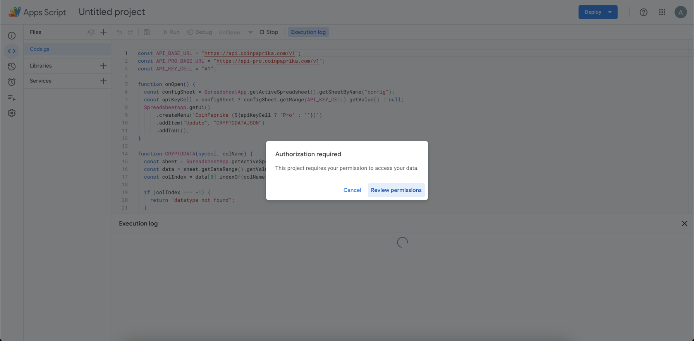
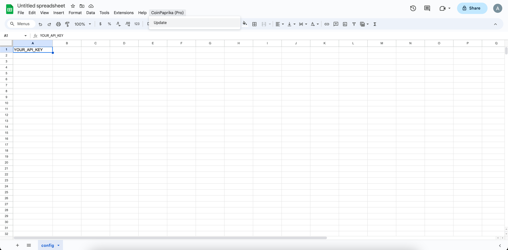

# CoinPaprika Google Sheets Integration

Welcome to the CoinPaprika Google Sheets Integration! This tool allows you to seamlessly fetch cryptocurrency data into your Google Sheets, making it easy to keep track of the latest market information.

## Features

- **Easy Integration:** Quickly import cryptocurrency data into your Google Sheets.
- **Automatic Updates:** Stay up-to-date with automatic data updates.
- **Customization:** Fetch specific data points or entire datasets.

## How to:

### Step 1: Open Google Sheets

Open your Google Sheets document where you want to integrate CoinPaprika data.

### Step 2: Configure API Key (Optional)

If you have an API key, configure it in the "config" sheet in A1 cell. If not, the tool will work without it.

### Step 3: Access Script Editor

Navigate to the "Extensions" menu and select "Apps Script" to open the Script Editor.

### Step 4: Copy and Paste Script

Copy the script provided in the repository and paste it into the Script Editor.

### Step 5: Save and Run and Authorize

Save the script, and you might need to authorize the script to access your Google Sheets.

### Step 6: Update Data

Go back to your Google Sheets document and find the new "CoinPaprika" menu. Select "Update" to fetch the latest cryptocurrency data.

## API-PRO Features

Upgrade to CoinPaprika API-PRO for additional benefits:

- **Historical Data:** Access historical cryptocurrency data.
- **Expanded Asset Coverage:** Get data for a broader range of assets.
- **Shorter Price Calculation Periods:** Calculate prices for shorter time intervals.

[Upgrade to API-PRO](https://coinpaprika.com/api) and supercharge your experience!

## About CoinPaprika

[CoinPaprika](https://coinpaprika.com) is a leading cryptocurrency provider, offering comprehensive market data and insights. Trusted by thousands of users, CoinPaprika provides reliable and up-to-date information on cryptocurrencies.

## Documentation

Explore the [CoinPaprika API Documentation](https://api.coinpaprika.com) for detailed information on available endpoints, parameters, and usage guidelines.

## Credits

This Google Sheets integration is based on the original work by [Pedrojok01](https://github.com/Pedrojok01/Import-CryptoData-into-GoogleSheet).

---
