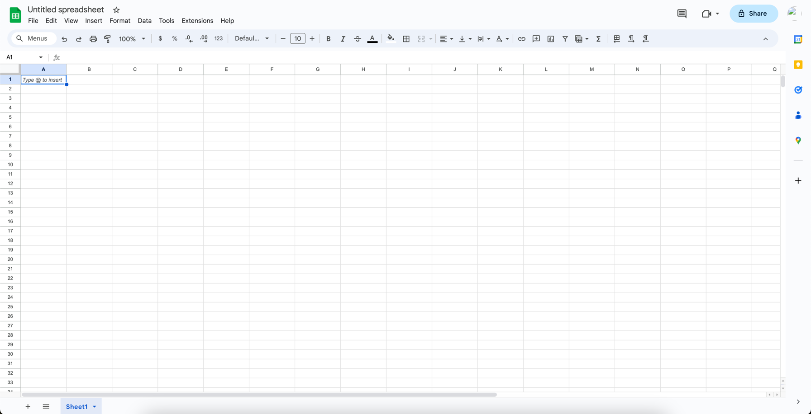
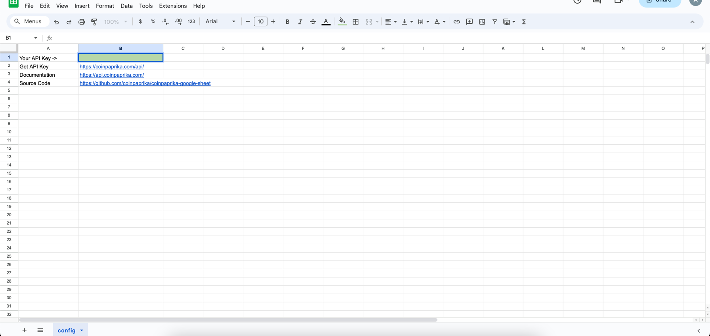
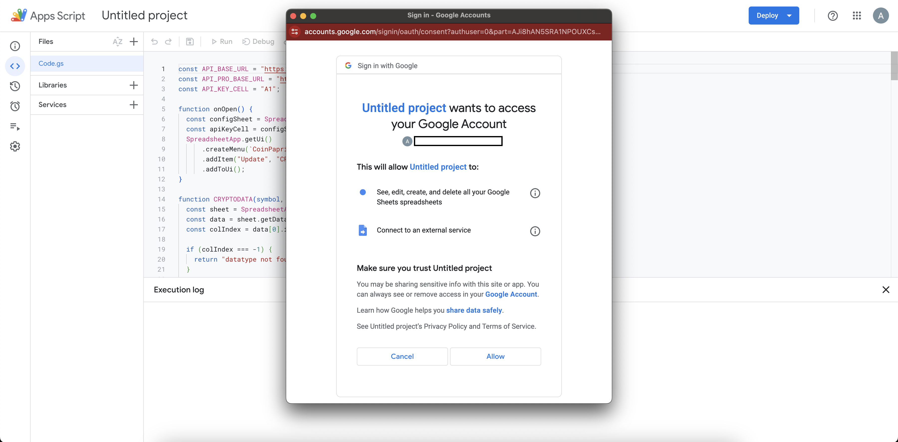

# CoinPaprika Google Sheets Integration

Welcome to the updated CoinPaprika Google Sheets Integration! This tool integrates real-time cryptocurrency data from CoinPaprika into Google Sheets, enabling advanced tracking and analysis of the cryptocurrency market.

## Features

- **Direct API Integration:** Fetch real-time cryptocurrency data from CoinPaprika's API.
- **Custom Functions:** Access various data points, including historical data, ticker information, global crypto market data, and specific coin details.
- **API-PRO Compatibility:** Leverage enhanced features with CoinPaprika's API-PRO for more detailed data access.
- **Simple Configuration:** Use API key as a parameter for expanded data access.

## Setup Guide

### Step 1: Open Google Sheets
Create or open an existing Google Sheets document for cryptocurrency data integration.

### Step 2: Access Script Editor
In Google Sheets, navigate to "Extensions" > "Apps Script" to open the Script Editor.

### Step 3: Copy and Paste the Script
Copy the CoinPaprika integration [script from the repository](https://raw.githubusercontent.com/coinpaprika/coinpaprika-google-sheet/main/script.gs) and paste it into the Script Editor.

### Step 4: Save and Authorize
Save the script. If running for the first time, Google will prompt you to authorize the script.

### Step 5: Start Using Functions
Use the custom functions in your sheet with the required parameters, including the API key if you have one.

## Available Functions

1. **CP_TICKERS_ALL(apiKey)**:
    - Fetches a comprehensive list of cryptocurrency tickers with data in USD and BTC quotes.
    - Parameters:
        - `apiKey` (string): API key for CoinPaprika, if available.
   <!-- [Insert screenshot of CP_TICKERS_ALL function in use] -->

2. **CP_TICKERS(symbol, colName, apiKey)**:
    - Fetches specific data for a given cryptocurrency symbol.
    - Parameters:
        - `symbol` (string): Symbol of the cryptocurrency (e.g., 'BTC').
        - `colName` (string): Name of the data column to retrieve (e.g., 'price').
        - `apiKey` (string): API key for CoinPaprika, if available.

3. **CP_TICKERS_HISTORY(coinId, date, type, quote, apiKey)**:
    - Retrieves historical data for a specified cryptocurrency.
    - Parameters:
        - `coinId` (string): ID of the cryptocurrency (e.g., 'btc-bitcoin').
        - `date` (string): Date for historical data in 'YYYY-MM-DD' format.
        - `type` (string): Type of historical data to retrieve (e.g., 'price').
        - `quote` (string): Quote currency (default is 'usd').
        - `apiKey` (string): API key for CoinPaprika, if available.

4. **CP_COINS(coin_id, colName, apiKey)**:
    - Retrieves specific details about a cryptocurrency based on its coin ID.
    - Parameters:
        - `coin_id` (string): Unique identifier of the cryptocurrency (e.g., 'bitcoin').
        - `colName` (string): Name of the property to retrieve (e.g., 'usd/price').
        - `apiKey` (string): API key for CoinPaprika, if available.

5. **CP_GLOBAL(apiKey)**:
    - Fetches and populates global cryptocurrency data.
    - Parameters:
        - `apiKey` (string): API key for CoinPaprika, if available.

## API-PRO Features

Upgrade to CoinPaprika API-PRO for additional insights:
- **Enhanced Historical Data**: Access detailed historical data.
- **Wider Asset Coverage**: Track a broader range of cryptocurrencies.
- **Frequent Price Updates**: Get more refined price updates.

[Upgrade to API-PRO](https://coinpaprika.com/api) for advanced features.

## About CoinPaprika

[CoinPaprika](https://coinpaprika.com) provides comprehensive market data and is a trusted resource for cryptocurrency insights.

## Support and Feedback

For support, suggestions, or feedback, please visit [GitHub Issues](https://github.com/your-repository/issues) of this repository.

## Legal Disclaimer

This tool is
