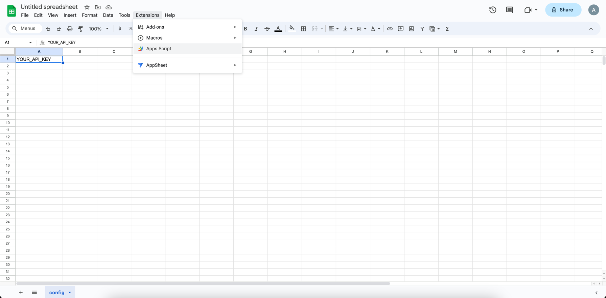
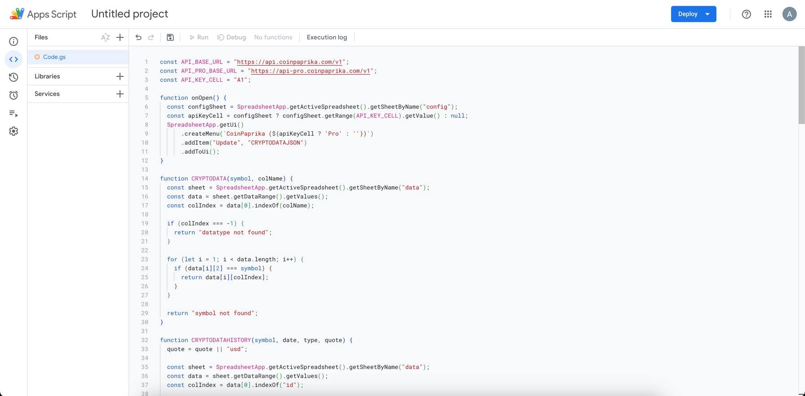
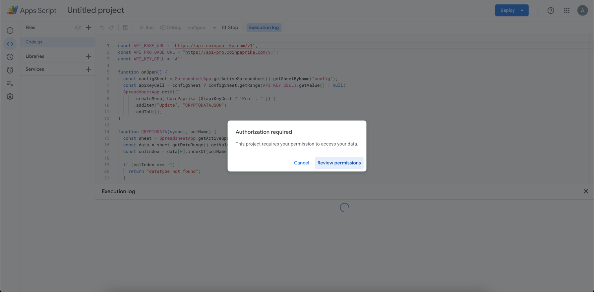
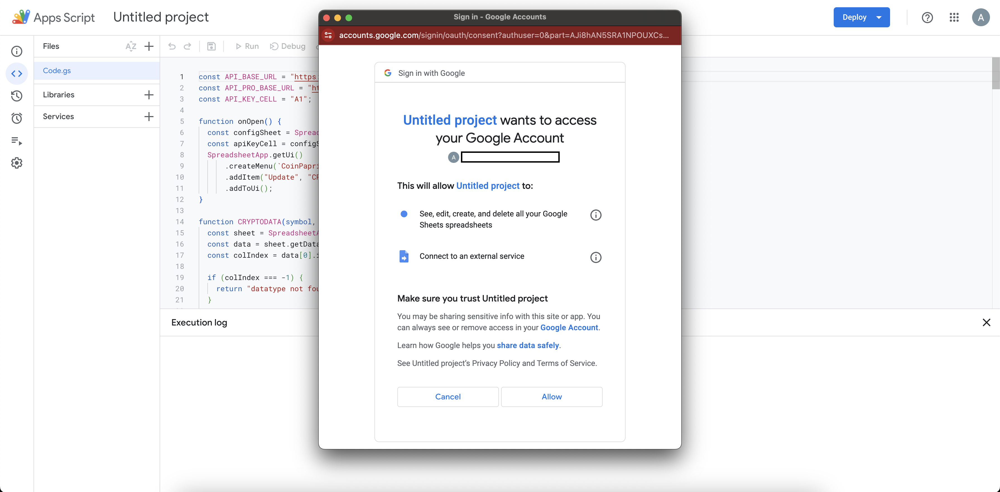
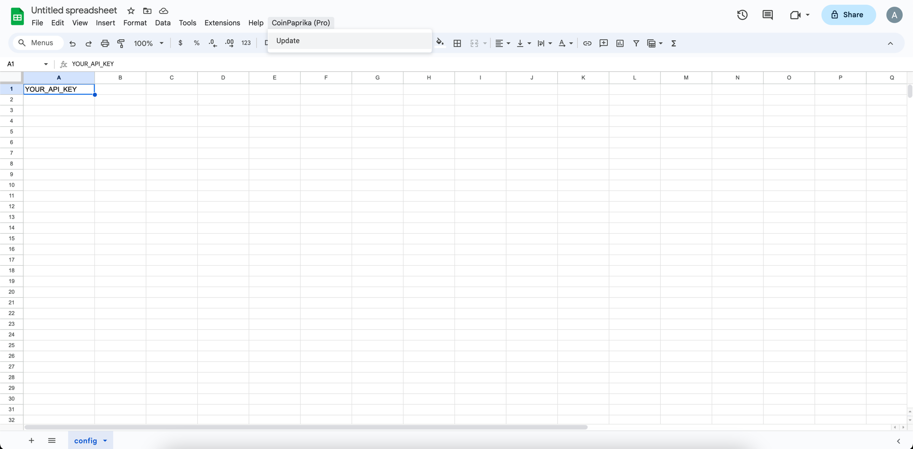
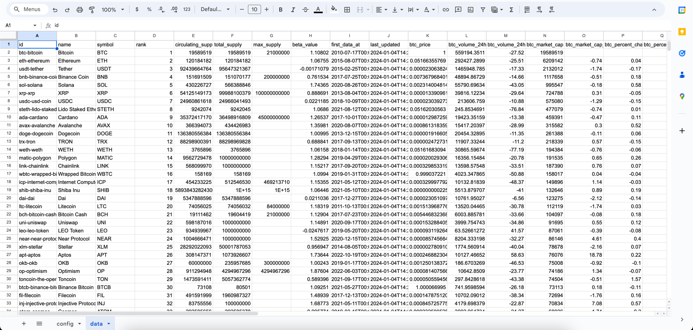

# CoinPaprika Google Sheets Integration

Welcome to the CoinPaprika Google Sheets Integration! This powerful tool seamlessly integrates cryptocurrency data from CoinPaprika into Google Sheets, enabling you to track the latest market information effortlessly.

## Features

- **Seamless Integration:** Easily import and automatically update cryptocurrency data in your Google Sheets.
- **Customizable Data Retrieval:** Fetch specific data points or entire datasets based on your needs.
- **Historical Data Access:** (With API-PRO) Dive into historical cryptocurrency data for in-depth analysis.

## Setup Guide

### Step 1: Open Google Sheets

Open the Google Sheets document where you want to integrate CoinPaprika data.

### Step 2: Import the CoinPaprika Template

Before using the script, import the `coinpaprika.xml` template into your Google Sheets.

- Download the `coinpaprika.xml` file from the repository.
- In Google Sheets, go to `File` > `Import` > `Upload`.
- Select the downloaded `coinpaprika.xml` file and upload it.
- Choose how you want the data to be inserted (e.g., as a new sheet or replace the current sheet).
- After importing, ensure the data structure matches the expected format for the script.

### Step 3: Configure API Key (Optional)

If you have an API key, enter it in the "config" sheet in cell B1. This step is optional; the tool works without an API key, but with limited features.

### Step 4: Access Script Editor

Navigate to "Extensions" > "Apps Script" to open the Script Editor.

### Step 5: Copy and Paste the Script

Copy the script from the repository and paste it into the Script Editor.

### Step 6: Save, Run, and Authorize

Save the script. You may need to authorize the script to access your Google Sheets.

### Step 7: Fetch and Update Data

Return to your Google Sheets document. Use the new "CoinPaprika" menu to fetch the latest cryptocurrency data.

## API-PRO Features

Upgrade to CoinPaprika API-PRO for more insights:

- **Enhanced Historical Data**: Access detailed historical data.
- **Greater Asset Coverage**: Track a wider range of cryptocurrencies.
- **Refined Price Calculation**: Get more frequent price updates.

[Upgrade to API-PRO](https://coinpaprika.com/api) for advanced features.

## About CoinPaprika

[CoinPaprika](https://coinpaprika.com) offers comprehensive market data, making it a trusted resource for cryptocurrency insights.

## Documentation

For detailed API information, visit the [CoinPaprika API Documentation](https://api.coinpaprika.com).

## Credits

This integration is inspired by [Pedrojok01](https://github.com/Pedrojok01/Import-CryptoData-into-GoogleSheet).

## Support and Feedback

For support, suggestions, or feedback, please visit [GitHub Issues](https://github.com/your-repository/issues) of this repository.

## Legal Disclaimer

This tool is provided 'as is', without warranty of any kind. Users should adhere to CoinPaprika's API terms of service.

## Contribute

Contributions to enhance this tool are welcome! Please follow the contributing guidelines in the repository.
